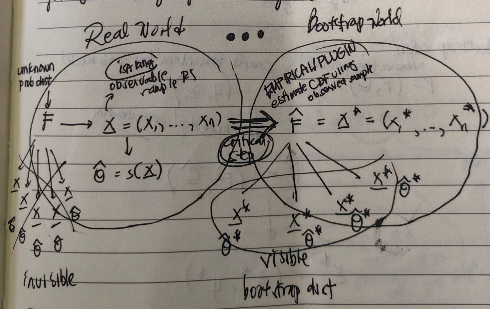

```{r setup, include=FALSE}
knitr::opts_chunk$set(echo = TRUE, fig.align = 'center', fig.height = 4, fig.width = 6, out.width = "400px")
```


## Driving Force in Bootstrap

Plug-in principle: We can plugin an estimate for $F$ by using the empirical distribution or when the structure of $F$ is known, by substituting the estimator of an unknown parameter.

Remarks about bootstrap (Hesterberg,2021):

* When sampling from estimated distribution, the resulting bootstrap distribution provides useful information about the sampling distribution of the statistic.  
* Bootstrap distribution is centered at the observed statistic, not the parameter. That is, the mean of the bootstrap estimates is not $\mu$ but $\bar x$. As a result, we do not use the mean of the bootstrap  statistic as a replacement for the original estimator (e.g., bootstrap cannot improve upon $\bar x$) as an estimator for $\mu$.  
* Bootstrap is for estimating only the SE (it is only use to estimate parameter for some, e.g. quantiles)
* Bootstrap is implemented by Monte Carlo sampling. Estimator of SE improves as $B$ increases, as long as sampling is $iid$.  
* Bootstrap principle: Sample acts as a new population; bootstrap sample take the place of the sample


```{r echo = FALSE}
#getwd()

```


<p style="font-size:10px;">
Aside from [wabash.edu](http://www3.wabash.edu/econometrics/EconometricsBook/chap23.htm#:~:text=A%20big%20difference%20between%20the,known%20values%20of%20the%20parameters).): A big difference between the methods, however, is that bootstrapping uses the original, initial sample as the population from which to resample, whereas Monte Carlo simulation is based on setting up a data generation process (with known values of the parameters).
</p>

## Examples {.tabset}

### Median and Winzorized mean (nonpar)

**Example (Efron & Hastie, Computer aged statistical inference):** GFR indicator of kidney fcn
- glomerular filtration rate
- low valu - bad sign
- $n = 211$ d=kidney patients, data on GFR
- skewed distribution  (so sample mean might not be a good way of summarizing data)
- better way to summarize: sample median, trimmed mean, winzorized mean (these are robust to outliers good for skewed data)
Let $X_{(1)}, X_{(2)}, \dots, X_{(10)}$ be ordered non decreasing data for $n = 10$

$10\%$ winsorized mean:  

We trim or remove the bottom $10\%$ and top $10\%$ of the ordered data and replace them with the new min and max, respectively. In this case, we trim $X_{(1)}$ and $X_{(10)}$ since $10\%$ of 10 is 1. We then replace them with $X_{(2)}$ and X_{(9)}, respectively.

$$
W(10\%) = \frac{X_{(2)} + X_{(2)} + X_{(3)} + X_{(4)} + X_{(5)} + X_{(6)} + X_{(7)}+ X_{(8)} + X_{(9)} + X_{(9)}}{10}
$$

$20\%$ winsorized mean: 

$$
W(20\%) = \frac{X_{(3)} + X_{(3)} + X_{(3)} + X_{(4)} + X_{(5)} + X_{(6)} + X_{(7)}+ X_{(8)} + X_{(8)} + X_{(8)}}{10} 
$$

How to determine the percent when using winsorized mean? Deoend on the data, consider the proportion of outliers that need to be trimmed.

Algorithm ($se(\tilde X)$ median and $\mathcal W$ winsorized mean): 

1. Take $B= 1000$ boot samples ($n = 211$) from the data $\{x_1, \dots, x_{211}\}$  
   boot sample 1: $X_{1,1}^*, \dots, X_{211,1}^* \overset{iid} \sim \{x_1, \dots, x_{211}\} \rightarrow \{\tilde X_1^*, \mathcal W_1^*\}$  
   boot sample 2: $X_{1,2}^*, \dots, X_{211, 2}^* \overset{iid} \sim \{x_1, \dots, x_{211}\} \rightarrow \{\tilde X_2^*, \mathcal W_2^*\}$  
   $\vdots$  
   boot sample B: $X_{1,B}^*, \dots, X_{211, B}^* \overset{iid} \sim \{x_1, \dots, x_{211}\} \rightarrow \{\tilde X_B^*, \mathcal W_B^*\}$  
   
2. Calculate bootstrap estimate of the SE:

   $$
   \widehat{se}(\tilde X) = \sqrt \frac{\sum_{i=1}^B\left(\tilde X_i^*-\bar{\tilde X^*}\right)^2}{B-1};\ \ \bar{\tilde X^*} = \frac{1}{B}\sum^B_{i=1} \tilde X_i^*
   $$
   
   $$
   \widehat{se}(\mathcal W) = \sqrt \frac{\sum_{i=1}^B\left(\mathcal W_i^*-\overline{\mathcal W^*}\right)^2}{B-1};\ \ \overline {\mathcal W^*} = \frac{1}{B}\sum^B_{i=1} \mathcal W_i^*
   $$
   
Aside:  

- Winsorized mean  

  $$
  \mathcal W \left(\frac{k}{n}\right) = \frac{1}{n} \left[ k x_{(k+1)} + \sum^{n-k}_{i = k+1} x_{(i)} + kx_{(n-k)} \right] 
  $$
- CLT applies to winsorized mean


```{r}

library(DescTools)
gfr <- read.csv('datasets/gfr.csv',header=T)
gfr <- gfr[,1]; n <- length(gfr)

hist(gfr,probability=T,col='blue',main='Relative frequency histogram') #Relative frequency historgram
lines(density(gfr),col='red')
boxplot(gfr,horizontal=T)


mean(gfr)
median(gfr)
data.win <- Winsorize(gfr, minval=tail(Small(gfr, k=52), 1), maxval=head(Large(gfr, k=52), 1))
sort(data.win)
mean(data.win)


###################ESTIMATING STANDARD ERRORS#########################
B <- 1000 # number of bootstrap samples
set.seed(100)
mean.b <- c(); median.b <- c(); winsorized.mean.b <- c()
for (j in 1:B){
  boot.s <- sample(gfr,n,replace=TRUE) #SRSWR
  mean.b[j] <- mean(boot.s)
  median.b[j] <- median(boot.s)
  winsorized.mean.b[j] <- mean(Winsorize(boot.s, minval=tail(Small(boot.s, k=52), 1), maxval=head(Large(boot.s, k=52), 1)))
  #Get the 25% Winsorized mean
}

s1 <- sd(gfr)/sqrt(n)   #Standard error of sample mean
s2 <- sd(median.b) #Bootstrap est of the SE of sample median
s3 <- sd(winsorized.mean.b) #Bootstrap est of the SE of winsorized mean

#c(mean(gfr),median(gfr),mean(Winsorize(gfr, minval=tail(Small(gfr, k=52), 1), maxval=head(Large(gfr, k=52), 1))))
c(s1,s2,s3)  

hist(median.b,main='Histogram of bootstrap medians')
hist(winsorized.mean.b,main='Histogram of Winsorized means')
```

### Parametric bs from binomial dist

**D. Vogan MIT**

Consider sample count data: ${6, 5,5,5,7,4}$; $n = 6$. Suppose the data is a random sample fro the binomial distribution $\mathcal {Bi} (8, \theta)$ (parameters: number of trials, success probability, resp.). How can we use the bootstrap to estimated the $se(\hat \theta)$ and compute a $95\%$ CI for $\theta$?

Aside: 

If $\{X_1, \dots ,X_n\} \overset{iid} \sim Binom(m, \theta)$, then

$$
\hat \theta = \frac{\sum^n_{i=1}}{mn}, \quad \text{MLE of }\theta
$$

Also,

$$
V(\hat \theta) = \frac{1}{m^2n^2} V\left(\sum^n_{i=1}X_i\right) = \frac{\theta (1-\theta)}{m^2n^2}, \quad \theta\text{ is unknown}
$$

Now, for the bootstrap, plug in $\hat V(\hat \theta)$ and $\theta$. Note that that estimate might not be accurate if n is small.

Algorithm to compute parametric boot CI for $\theta$:

1. Take $B$ boot samples ($n = 6$) from the $\mathcal{Bi}(8, \hat \theta)$  
   boot sample 1: $X_{1,1}^*, \dots, X_{6,1}^* \overset{iid} \sim \mathcal{Bi}(8, \hat \theta) \rightarrow \hat \theta^*_{1,MLE}$  
   boot sample 2: $X_{1,2}^*, \dots, X_{6, 2}^* \overset{iid} \sim \mathcal{Bi}(8, \hat \theta) \rightarrow \hat \theta^*_{2,MLE}$  
   $\vdots$  
   boot sample B: $X_{1,B}^*, \dots, X_{6, B}^* \overset{iid} \sim \mathcal{Bi}(8, \hat \theta) \rightarrow \hat \theta^*_{B,MLE}$  
   
   where $\hat \theta_{b, MLE}^* = \sum^n_{i=1} \frac{X_{ib}^*}{nm}, \ b = 1, \dots, B$  
   
2. Calculate bootstrap estimate of the SE:  

   $$
   \widehat{se}(\hat \theta) = \sqrt \frac{\sum_{i=1}^B\left(\hat \theta_i^*-\bar{\hat \theta^*}\right)^2}{B-1};\ \ {\hat \theta ^*} = \frac{1}{B}\sum^B_{i=1} \hat \theta _i^*
   $$
   
   Bootstrap $95\%$ CI for $\theta: (\hat \theta ^*_{0.025}, \hat \theta ^*_{0.975})$
   

Aside: $\hat \theta = \frac{\sum X_i}{mn} = \frac{1}{n} \left(\sum ^n_{i=1} \frac{X_i}{m}\right)$. $n$ is too small for the sample mean $\frac{X_i}{m}$ to expect normal approximation results from CLT. Bootstrap could be better.


```{r}
data <- c(6,5,5,5,7,4) #Assumed to come from Binom(8,theta)
n=6 #sample size
m=8 #number of trials
theta.hat <- sum(data)/(m*n)

?rbinom
set.seed(200)
B = 10000 # 10000 bootstrap samples
theta.hat.star <- c()
for (b in 1:B){
  data.star <- rbinom(n=6,size=8,prob=theta.hat) #plug-in
  #parametric bootstrap
  #rbinom(n,size,prob); n= # obs; size= # trials; prob=success
  theta.hat.star[b] <- sum(data.star)/(m*n)
}

var(theta.hat.star) #boot. est. of variance
sd(theta.hat.star) #boot. est. of. standard error

quantile(theta.hat.star,c(.025,.975))
#What if we do less than 10000 bootstrap samples?
```


### Independent Samples (se(mean diff)): HT

Data Layout:  
- Treatment: $\mathbf z = (z_1, \dots, z_m)'$  
- Control: $\mathbf y = (y_1, \dots, y_n)'$   

Notations:  
- $\mathcal F$, CDF of treatment group  
- $\mathcal G$, CDF of control group  
- $\mathcal P = (\mathcal F, \mathcal G)$, probability model where $\mathcal F$ and $\mathcal G$ are completely unknown  
- $\hat {\mathcal F}$, CDF of treatment group  
- $\hat {\mathcal G}$, CDF of control group  
- $\mathbf x = (\mathbf z , \mathbf y)$, observed data  

Goal:  
Test $H_0: \mu_z = \mu_y$ vs $H_1: \mu_z \neq \mu_y$, $\mu_z > \mu_y$, $\mu_z < \mu_y$

Bootstrap scheme:  
With $\mathcal P = (\mathcal F, \mathcal G)$ unknown, we sample from the observed data (sample) $\mathbf x = (\mathbf z , \mathbf y)$ to estimate the CDF  $\hat {\mathcal P} = \left( \hat {\mathcal F}, \hat {\mathcal G}\right)$. This is composed of $\mathbf x^* = (\mathbf z^* , \mathbf y^*)$

**Example: E&T** 16 mice etc.  

Group:  
- Treatment ($\mathbf z$): $94, 197, 16, 38, 99, 141, 23$  
- Control ($\mathbf y$): $52, 104, 146, 10, 51, 30, 40, 27, 46$  


```{r}
z <- c(94, 197, 16, 38, 99, 141, 23)
y <- c(52, 104, 146, 10, 51, 30, 40, 27, 46)

mean_z <- mean(z)
se_z <- sd(z)/(sqrt(length(z)))
mean_y <- mean(y)
se_y <- sd(y)/(sqrt(length(y)))

paste(c("mean_z",mean_z))
paste(c("mean_y",mean_y))
paste(c("se_z",se_z))
paste(c("se_y",se_y))
```

Is there sufficient evidence that $\mu_z - \mu_y > 0$

$$
\hat \theta = \bar z - \bar y 
$$

```{r}
theta_hat <- mean_z - mean_y
paste(c("theta_hat",theta_hat))
```

$$
\widehat{se} \left( \bar z - \bar y \right) = \sqrt {\frac{s^2_z}{m} + \frac{s^2_y}{n}}
$$

```{r}
se_diff <- sqrt(se_z^2 + se_y^2)
paste(c("se_diff",se_diff))
```

The `se_diff` is too large for us to be able to say that the $\hat \theta > 0$

T-test formula:

$\frac{\bar z - \bar y}{\widehat{se} \left( \bar z - \bar y \right)}$ = `r theta_hat/se_diff` (too low to be significant). This is due to the small sample size.

Aim: To know how far the bootstrap estimate of the SE will be compared to the formula procedure to estimate $\widehat{se} \hat{\theta}$.


Algorithm:

1. Take $B$ nonpar boot samples  
   $\mathbf z_b^* = \left(z^*_{1b}, \dots, z^*_{mb}\right) \overset{iid} \sim \left(z_1, \dots, z_m \right)$  
   $\mathbf y_b^* = \left(y^*_{1b}, \dots, y^*_{mb}\right) \overset{iid} \sim \left(y_1, \dots, y_n \right)$  
   $b = 1, \dots, B$  
   
2. Compute $\hat \theta_b^* = \bar z_b^* - \bar y_b^*, \quad = 1, \dots, B$ where $\bar z_b^* = \frac{1}{m}\sum^m_{i=1} z_{ib}^*$

3. $\widehat {se} (\theta) = \sqrt{ \frac{\sum \left( \hat \theta_b^* - \bar{\hat \theta_b^*}\right)^2}{B-1} }$

   $$
   \widehat{se}(\hat \theta) = \sqrt \frac{\sum_{i=1}^B\left(\hat \theta_i^*-\bar{\hat \theta^*}\right)^2}{B-1};\ \ {\hat \theta ^*} = \frac{1}{B}\sum^B_{i=1} \hat \theta _i^*
   $$
   
   Bootstrap $95\%$ CI for $\theta: (\hat \theta ^*_{0.025}, \hat \theta ^*_{0.975})$
   

Aside: $\hat \theta = \frac{\sum X_i}{mn} = \frac{1}{n} \left(\sum ^n_{i=1} \frac{X_i}{m}\right)$. $n$ is too small for the sample mean $\frac{X_i}{m}$ to expect normal approximation results from CLT. Bootstrap could be better.

$\bar{z}=86.84$ 
$\bar{y}=56.22$

(E&T 26.85)


```{r}
set.seed(200)
B=1400
z <- c(94, 197, 16, 38, 99, 141, 23) #Treatment
y <- c(52, 104, 146, 10, 51, 30, 40, 27, 46) #Control
theta.star <- c()
for(b in 1:B){
  z.s <- sample(z,length(z),replace=T) #nonpar SRSWR
  y.s <- sample(y,length(y),replace=T) #nonpar SRSWR
  theta.star[b] <- mean(z.s) - mean(y.s)
}
se.theta.boot <- sd(theta.star)
print(paste(c("se.theta.boot", se.theta.boot)))
print(paste(c("mean diff", mean(z)-mean(y))))
sum(theta.star < 0)/1400 # (proportion of ybar greater than zstar); we want this value to be small
plot(density(theta.star))
```

#### 